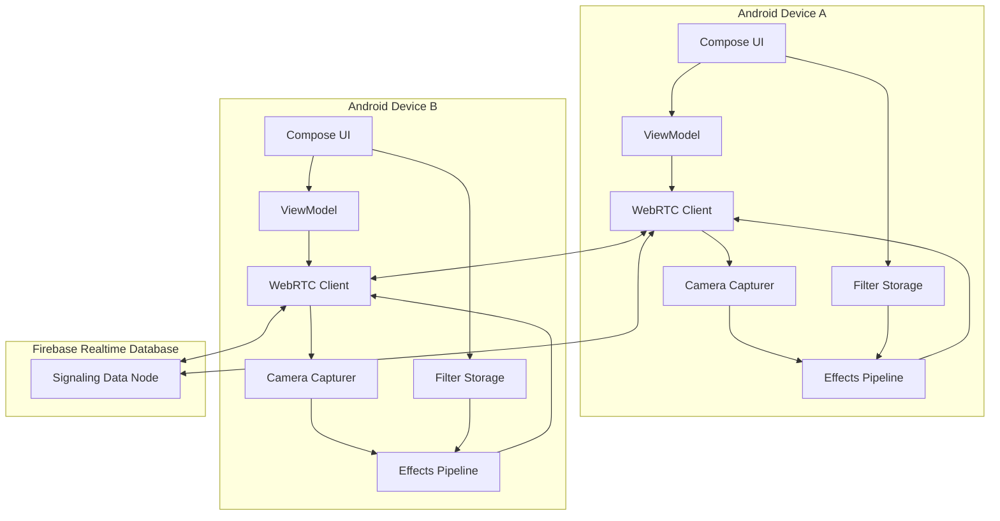
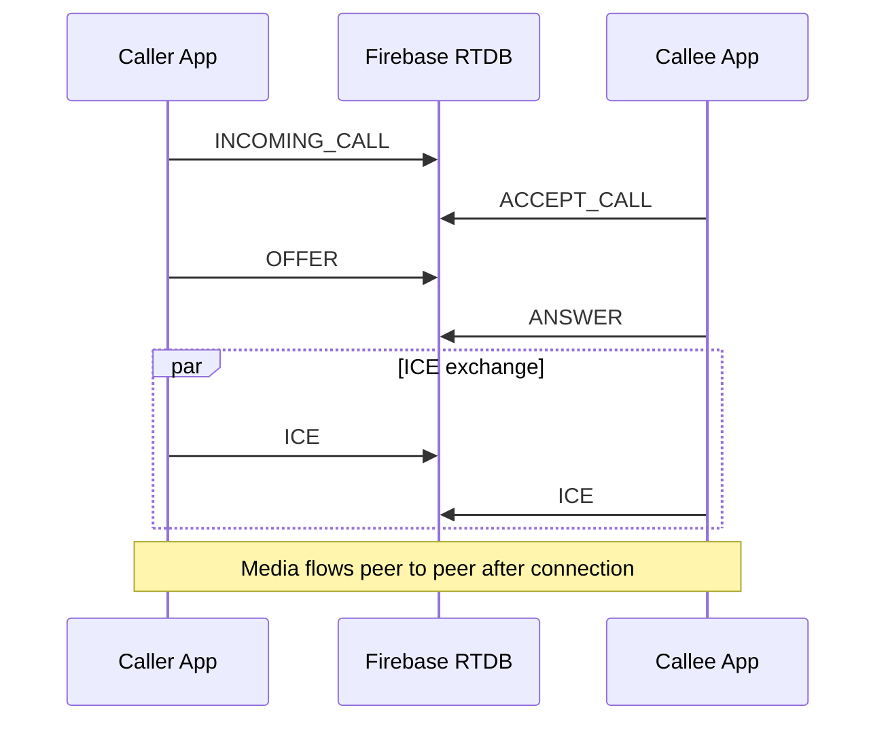
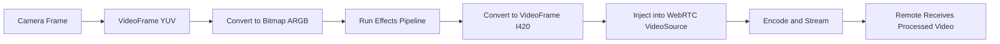
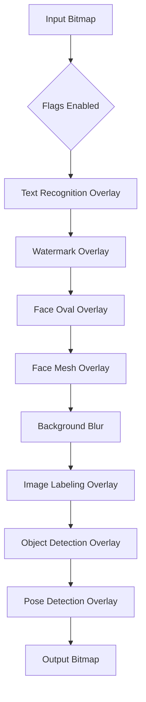
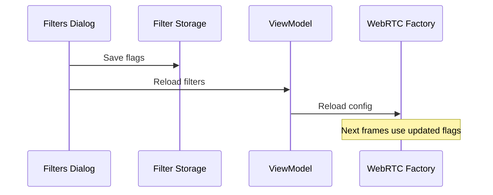

# WebRTC Video Call with ML Kit Filters (Android • Jetpack Compose - Firebase)

This project demonstrates a complete **MVP video calling app** where **real-time camera frames are processed with ML Kit-based effects (filters) before being streamed via WebRTC**.

It includes:

- **Peer-to-peer video calling (WebRTC)**
- **Google Firebase Realtime Database as the signaling server**
- **Live, toggleable ML Kit filters applied before streaming**
- **Jetpack Compose UI with runtime filter configuration**

---

## 🎥 Video Tutorial & Playlist (YouTube)

📺 **Watch the full tutorial here:** [YouTube Playlist](https://youtube.com/playlist?list=PLFelST8t9nqgqOFypRxdTQZ4xX9Ww6t8e&si=joSiiHfmLSuefaEu)

> This repository is part of a YouTube course series. Make sure to follow the playlist for full implementation details.

---

# 🧩 MVP Overview

This project builds a fully functional **two-user video calling application** with real-time video processing.

## ✅ What This MVP Includes

### 1️⃣ Two-User Video Calling Flow
- Caller sends an `INCOMING_CALL` signal
- Callee accepts with `ACCEPT_CALL`
- WebRTC SDP `OFFER` / `ANSWER` exchanged via Firebase
- ICE candidates exchanged via Firebase
- Peer-to-peer media stream established

### 2️⃣ Real-Time Video Frame Processing
- Camera `VideoFrame` is converted to a `Bitmap`
- ML Kit filters and overlays are applied
- Processed `Bitmap` is converted back to a WebRTC `VideoFrame`
- Processed frame is injected into WebRTC and streamed

### 3️⃣ Runtime Filter Toggles
- Filters can be enabled/disabled from UI
- Flags are persisted (e.g., SharedPreferences)
- The capture pipeline reloads configuration dynamically
- No call restart required

---

# 🏗️ Tech Stack

- Kotlin
- Jetpack Compose
- WebRTC (Android)
- Google Firebase Realtime Database (Signaling)
- Google ML Kit (Vision APIs)

---

# 🔥 Firebase as the Signaling Server

This project uses **Google Firebase Realtime Database** as the signaling server.

⚠️ Important:  
Firebase does NOT transmit audio or video streams.  
It is only responsible for exchanging negotiation data required to establish a WebRTC peer-to-peer connection.

Once WebRTC is connected:
- Audio and video flow directly between devices.
- Firebase is no longer involved in media transmission.

---

## 📡 What Firebase Handles

Firebase Realtime Database is responsible for:

- Sending incoming call notifications
- Exchanging SDP Offers
- Exchanging SDP Answers
- Exchanging ICE Candidates
- Managing basic call state

---

## 🗂 Example Realtime Database Structure

### A simplified signaling structure:
- USERS
- ├── userA
- │   └── DATA
- │       ├── type: "OFFER"
- │       └── sdp: "v=0..."
- │
- └── userB
- └── DATA
- ├── type: "ANSWER"
- └── sdp: "v=0..."

### Signaling Message Types

- `INCOMING_CALL`
- `ACCEPT_CALL`
- `OFFER`
- `ANSWER`
- `ICE`

Each user observes their Firebase node in real-time and reacts accordingly.

---

# 🔄 Call Flow (Firebase + WebRTC)

### 1) Caller Starts Call
Caller writes `INCOMING_CALL` to callee's Firebase node.

### 2) Callee Accepts
Callee responds with `ACCEPT_CALL`.

### 3) WebRTC Negotiation
- Caller creates and sends `OFFER`
- Callee sets remote description and generates `ANSWER`
- Both sides exchange ICE candidates

### 4) Peer-to-Peer Connection Established
After SDP + ICE exchange:
- Direct WebRTC connection is formed
- Audio/Video streams flow directly device-to-device

---

# ✨ The Core Feature: Frame Processing Before Streaming

This project does NOT stream raw camera frames.

Instead, it intercepts and modifies every frame before sending it.

---

## 🎥 Frame Processing Pipeline

1️⃣ Camera provides a WebRTC `VideoFrame` (I420 / YUV format)

2️⃣ Frame is converted to a `Bitmap` (ARGB)

3️⃣ Enabled effects are applied sequentially:
- Text Recognition (OCR)
- Watermark overlay
- Face Oval overlay
- Face Mesh overlay
- Background blur (segmentation)
- Image labeling
- Object detection
- Pose detection

4️⃣ Processed Bitmap is converted back to I420 `VideoFrame`

5️⃣ The new frame is injected into WebRTC:

localVideoSource.capturerObserver.onFrameCaptured(processedFrame)

✅ Result:  
The remote peer receives the processed video, not the raw camera feed.

---

# 🎛️ Available Filters

Depending on which toggles are enabled:

- Text Recognition Overlay
- Watermark Overlay
- Face Oval Overlay
- Face Mesh Overlay
- Background Blur
- Image Labeling
- Object Detection
- Pose Detection

All filters are controlled through runtime configuration flags.

---

# 🧠 Live Filter Updates (Without Restarting Call)

1. User toggles filters in dialog
2. Flags are saved (SharedPreferences)
3. WebRTC pipeline reloads configuration
4. Subsequent frames immediately reflect new settings

Flags are cached in memory (often `@Volatile`) to ensure thread-safe updates during frame processing.

---

# 🗂 Project Structure (Conceptual)
- ui/
- ├── Compose screens
- ├── FiltersDialog
- utils/webrt/
- ├── PeerConnection setup
- ├── Video capturer
- ├── Frame interception
- effects/
- ├── ML Kit effect classes
- ├── VideoEffectsPipeline
- signaling/
- ├── Firebase Realtime Database handlers

---

# ⚙️ Setup & Run

## 1️⃣ Firebase Setup

1. Create a Firebase project
2. Enable **Realtime Database**
3. Configure development rules (allow read/write during testing)
4. Download `google-services.json`
5. Place it in:
   app/google-services.json

6. Sync Gradle

---

## 2️⃣ Run the App

- Open in Android Studio
- Run on two physical devices
- Use different user IDs for caller and callee

---

# 🚀 Performance Notes

This is an educational MVP.

Heavy processing occurs because:
VideoFrame → Bitmap → ML Kit → Bitmap → VideoFrame

ML Kit tasks can be CPU intensive.

### To Improve Performance:

- Process every N frames (e.g., every 3rd frame)
- Reduce camera resolution
- Use OpenGL shader pipeline
- Use optimized YUV conversion (libyuv)

---

# 📣 About the YouTube Channel – @CodeWithKael

This project is part of a tutorial series covering:

- WebRTC
- Firebase
- Jetpack Compose
- ML Kit
- Real-time video processing

🔔 Subscribe:  
https://www.youtube.com/@codewithkael

---

# ⭐ Support

If this project helped you:

- ⭐ Star the repository
- 📢 Share the playlist
- 🔔 Subscribe to the channel

---

